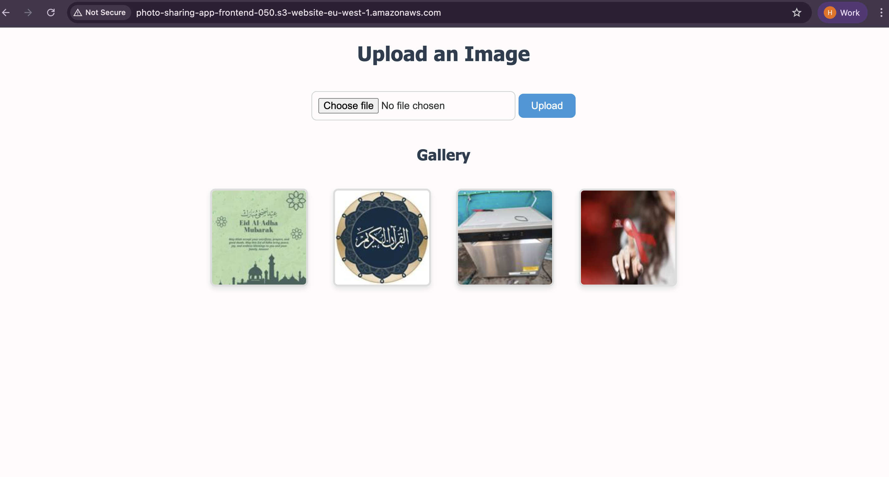

# Photo Sharing Web App (Serverless with AWS)

This project is a **serverless photo-sharing web application** built entirely with AWS services. Users can upload images via a simple web interface, which are then stored in an Amazon S3 bucket. Upon upload, an AWS Lambda function is automatically triggered to create a **resized thumbnail**, which is stored in a separate S3 bucket. Another Lambda function serves the list of thumbnails via **API Gateway**, which the frontend fetches and displays.

---

## Live App

**http://photo-sharing-app-frontend-050.s3-website-eu-west-1.amazonaws.com/**



---

## Features

* Upload photos to Amazon S3 via pre-signed URLs
* Automatically resize images using AWS Lambda
* Store resized thumbnails in a separate S3 bucket
* Retrieve and display thumbnails using API Gateway
* Fully serverless architecture (No backend server needed)
* CORS enabled for browser compatibility

---

## Architecture Overview

```text
[Client Browser]
      │
      ├─> GET /getUploadedUrl → API Gateway → Lambda (Presigned URL)
      │       │
      │       └─> Returns a PUT URL for the original S3 bucket
      │
      ├─> PUT image.jpeg → S3 (photo-sharing-app-bucket-050)
      │       │
      │       └─> Triggers Lambda (Resizer)
      │               └─> Resizes image and stores in photo-sharing-thumbnails-050
      │
      └─> GET /getThumbnailImages → API Gateway → Lambda (Thumbnail Lister)
              └─> Returns list of thumbnail URLs for display
```

---

## Technologies Used

* AWS S3
* AWS Lambda (Python)
* AWS API Gateway (REST API)
* IAM (Permissions)
* HTML/CSS (Frontend)
* JavaScript (Fetch API)

---

## Setup Instructions

### 1. IAM Permissions

Ensure your Lambda functions have the following permissions:

```json
{
  "Effect": "Allow",
  "Action": [
    "s3:GetObject",
    "s3:PutObject",
    "s3:ListBucket"
  ],
  "Resource": [
    "arn:aws:s3:::photo-sharing-app-bucket-050/*",
    "arn:aws:s3:::photo-sharing-thumbnails-050/*"
  ]
}
```

Attach this policy to the execution roles of both Lambda functions.

---

### 2. Create S3 Buckets

```bash
aws s3 mb s3://photo-sharing-app-bucket-050
aws s3 mb s3://photo-sharing-thumbnails-050
```

Enable S3 event notifications on `photo-sharing-app-bucket-050` to trigger the resizing Lambda function on new uploads.

---

### 3. Lambda Functions

#### a. `resizer-lambda`

Triggered when a new object is uploaded to the source bucket. Resizes and uploads to the thumbnail bucket.

#### b. `getThumbnailImages`

Returns all thumbnail image URLs for frontend display.

#### c. `getUploadedUrl`

Generates a pre-signed `PUT` URL to securely upload images directly to S3 from the frontend.

All Lambda function code is written in Python and provided earlier in this repo.

---

### 4.API Gateway Configuration

Create a REST API with these routes:

| Method | Route                          | Lambda               |
| ------ | ------------------------------ | -------------------- |
| GET    | `/getUploadedUrl?filename=...` | `getUploadedUrl`     |
| GET    | `/getThumbnailImages`          | `getThumbnailImages` |

✅ Make sure CORS is enabled on each route (headers: `*`, methods: `GET, OPTIONS`, etc.)

---

### 5. Frontend Integration

Simple upload & display using vanilla JS:

```html
<input type="file" id="imageInput" />
<button onclick="uploadImage()">Upload</button>
<div id="gallery"></div>
```

```js
async function uploadImage() {
    const file = document.getElementById('imageInput').files[0];
    if (!file) return alert("No file selected");

    const filename = encodeURIComponent(file.name);
    const res = await fetch(`https://YOUR_API_ID.execute-api.eu-west-1.amazonaws.com/prod/getUploadedUrl?filename=${filename}`);
    const { uploadUrl } = await res.json();

    await fetch(uploadUrl, {
        method: 'PUT',
        headers: { 'Content-Type': 'image/jpeg' },
        body: file
    });

    setTimeout(displayImages, 3000);
}

async function displayImages() {
    const res = await fetch("https://YOUR_API_ID.execute-api.eu-west-1.amazonaws.com/prod/getThumbnailImages");
    const images = await res.json();
    document.getElementById('gallery').innerHTML = images.map(url => ``).join('');
}
```

---

## 💻 Frontend
### `/index.html`

Basic HTML+JS page to upload and view images. The JavaScript:

- Calls `/getUploadUrl?filename=xyz.jpg`
- Uploads image using `fetch(PUT, presignedURL)`
- Loads thumbnails from `/getThumbnailImages`

---

## 🚀 Deploying the Frontend to AWS S3

You can deploy the frontend using **S3 Static Website Hosting**.

### Step 1: Enable Website Hosting

```bash
aws s3 website s3://photo-sharing-app-frontend-050/ \
  --index-document index.html \
  --error-document index.html
```
### Step 2: Make Bucket Public

**Create a file named `bucket-policy.json`:**

```
{
  "Version": "2012-10-17",
  "Statement": [
    {
      "Sid": "PublicReadGetObject",
      "Effect": "Allow",
      "Principal": "*",
      "Action": "s3:GetObject",
      "Resource": "arn:aws:s3:::photo-sharing-app-frontend-050/*"
    }
  ]
}

```
**Apply the policy:**

```
aws s3api put-bucket-policy \
  --bucket photo-sharing-app-frontend-050 \
  --policy file://bucket-policy.json

```

**Allow public access:**

```
aws s3api put-public-access-block \
  --bucket photo-sharing-app-frontend-050 \
  --public-access-block-configuration BlockPublicAcls=false,IgnorePublicAcls=false,BlockPublicPolicy=false,RestrictPublicBuckets=false

```

### Step 3: Upload Files

```
aws s3 sync ./frontend/ s3://photo-sharing-app-frontend-050/ --recursive 

```
### Step 4: Access Your Site

**Visit:**

```
http://photo-sharing-app-frontend-050.s3-website-eu-west-1.amazonaws.com

```
⚠️ Note: Don't use the S3 REST endpoint (.s3.amazonaws.com) directly; it will show Access Denied unless you specify the full index.html.

---

## Security Notes

* All uploads use time-limited pre-signed URLs
* No public write access to S3
* CORS headers are enabled to support frontend requests

---

## Example Usage

- Visit the frontend.
- Upload an image.
- Lambda resizes it.
- Thumbnails are displayed in the gallery.

---

## Testing Tips

* Use browser dev tools to inspect network requests
* Check S3 for uploaded and resized images
* Monitor CloudWatch logs for Lambda errors

---

## Future Improvements

* Add user authentication via AWS Cognito
* Add metadata (titles, tags, comments)
* Add delete image feature
* UI/UX enhancements using frameworks like React or Vue

---

## Author

Humaidu Ali Mohammed

---

## 📌 License

Open-source under the [MIT License](LICENSE).
